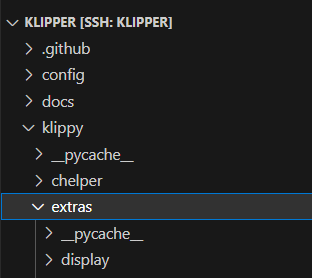

<p align="center">
  <a>
    <h1 align="center">Push Notification for Klipper</h1>
  </a>
</p>

<p align="center">
  <a></a>
  <a></a>
  <a></a>
  <a></a>
  <a></a>
  <br />
  <a></a>
  <a></a>
</p>

<hr>

<h2 align="center">
  Introduction
</h2>

I have been wanting to make my printer notify me whenever it finishes any print for some time now. And after I heard about Klipper, I soon realize that it can use python to extend its functionality. So I wrote this script to help me. And I hope this script can help you, too. 

This simple script will add push notification capabilty to Klipper. 

Klipper is a open source 3D Printer firmware. If you want to install Klipper, you can go to [Klipper 3D](https://www.klipper3d.org/) for detailed instruction

<h2 align="center"> 
    What you need
</h2>

This script is using [Pushover](https://pushover.net/) to send push notification to your phone. So you will need an account at Pushover to start. Please follow the link for registration detail. 

After you have registered, you'll receive your ***User key***. Then you have to create your ***API key*** for this script. 

<h2 align="center">
    Installation
</h2>

1. Download the source code of [notify.py](https://raw.githubusercontent.com/prd0000/push_notify/main/script/notify.py)

2. Copy the script into `<klipper folder>/klippy/extras` folder



3. add this to your printer.cfg configuration
```
[notify]
api_key: <your api key>
user_key: <your user key>
```

After you add the section to printer.cfg, do `FIRMWARE_RESTART` at Klipper. 

<h2 align="center">
    Usage
</h2>

#### Syntax
You can put it in any G-Code file like:

`PUSH_NOTIFY [DEVICE=<device>] [TITLE=<title>] MSG=<message>`

`DEVICE`: (optional) send a device id. This is corresponds to your device id registered at Pushoverr.

`TITLE`: (optional) put a title to the message. If you omit this, the script will default to empty string

`MSG`: (mandatory) is the message that you are going to send to your phone.

#### Command example:

`PUSH_NOTIFY DEVICE="my_phone" TITLE="filename.gcode" MSG="printing done"`

#### Macro example

Or you can also put it in your macro like:

```
[gcode_macro END_PRINT]
gcode:

    # Turn off bed, extruder, and fan
    M140 S0
    M104 S0
    M106 S0
    # Move nozzle away from print while retracting
    G91
    G1 Z10 E-5 F300
    G90
    G1 X10 Y300 F3000
    # Disable steppers
    M84
    # Notify User
    PUSH_NOTIFY MSG="Printing Done"

```

Enjoy