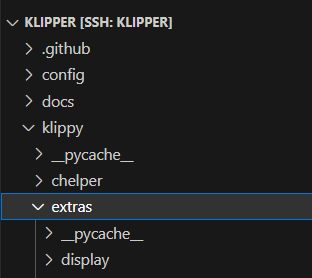

# Push Notification for Klipper</h1>

<p>
  <a></a>
  <a></a>
  <a></a>
  <a></a>
  <a></a>
  <a></a>
  <a></a>
</p>


## Introduction

I wanted my printer to notify me whenever a print finished. After discovering Klipper, I realized it supports Python extensions, making it easy to add custom functionality. This script was created to send push notifications from Klipper, and hopefully it can be useful for others as well.

This module adds push notification capability to Klipper.

Klipper is an open-source firmware for 3D printers. If you want to install Klipper, visit the official documentation [Klipper 3D](https://www.klipper3d.org/) for detailed instruction

## Features

<ul><li> Send push notification directly using GCODE
<li> Supports any HTTP-based notification service
<li> Two configuration modes:
<ul><li> Raw Mode -- Full Manual configuration
<li> Template Mode -- Simplified configuration using predefined templates
</ul>
<li> Supports optional parameters
<li> Works in any G-CODE commands or macros.
</ul>


## What you need

<ul><li>A running Klipper installation
<li>
An account on any push notification service.
<li> The API information required by that service (URL, headers, tokens, etc.)
</ul>

<br/>

# Installation

<ol>

**<li> Download these files from the extra folder:**

    notify.py
    server_template.py

**<li>  Copy both files into `<klipper folder>/klippy/extras` folder. **



**<li> Configure your `printer.cfg`**

Add a `[notify]` section to your configuration\
See the Configuration section below

**<li> Use `NOTIFY` command**

Example:

```
NOTIFY MSG="Printing Done" DEVICE="Creality" TITLE="Model.gcode"" SOUND="alert.mp3"
```

**<li> Restart Klipper**

`sudo systemctl restart klipper`

</ol>
<br/>

# Configuration


Push Notify supports two configuration modes:

<ol><li> Raw Mode
<li> Template Mode
</ol>

## Raw Mode

In Raw Mode, all request parameters must be defined manually inside `printer.cfg`.

Required options:

<ul>
<li>url
<li>headers
<li>body
<li>method
</ul>

Example confguration for Raw Mode:

```
[notify]
url: https://ntfy.sh/MyPrinter
timeout: 10
method: POST
headers:
    Content-Type: application/x-www-form-urlencoded
    Priority: urgent
    [Title: {TITLE}]
body:
    {MSG}
```

This will send a POST request to ntfy when `NOTIFY` called in GCode

> Note: 
`timeout` option is optional, and will default to 10s if omitted. This option is available in both Raw and Template Mode.

## Template Mode

Template Mode allows you to use predefined server templates.

In template mode, you only need to supply the parameters required by that template. 

Example:

```
[notify]
template: ntfy
topic: MyPrinter
```

Templates are defined in `server_template.py`.

Example template:

```
TEMPLATES = {
    'ntfy': {
        "url": 'https://ntfy.sh/{topic}',
        "headers": """
            Content-Type: application/x-www-form-urlencoded
            Priority: urgent
            [Title: {TITLE}]
        """,
        'body': '{MSG}',
        'method': 'POST'
    }
}
```

## Template Variables
Whether in `server_template.py` or `printer.cfg`, templates support dynamic variables using curly braces `{}`.

Example:

    {MSG}
    {TITLE}
    {topic}

Rules:
<ul><li>
Variables must contain only alphanumeric characters
<li>
Variables cannot start with a number
<li>
UPPERCASE variables are filled from the GCODE command
<li>

lowercase variables are taken from `printer.cfg`. 
> **Note:** Lowercase variables is not supported in **Raw Mode**

</ul>

### Optional Variables

Variable wrapped inside square brackets `[]` are optional.

Example:

```
[Title: {TITLE}
----]
{MSG}
```

If `{TITLE}` is not provided, the **entire block** will be removed. 

`NOTIFY MSG="Printing done" TITLE="Model.gcode"`


```
Title: Model.gcode
----
Printing done
```

or removed completely if no title is provided 

`NOTIFY MSG="Printing done"`

```
Printing done
```

<br/>

# Usage


You can put it in any G-Code command like:

```
NOTIFY DEVICE="my_phone" TITLE="filename.gcode" MSG="printing done"
```
Or you can also put it in your macro like:

```
[gcode_macro END_PRINT]
gcode:
    # Turn off bed, extruder, and fan
    M140 S0
    M104 S0
    M106 S0
    # Move nozzle away from print while retracting
    G91
    G1 Z10 E-5 F300
    G90
    G1 X10 Y300 F3000
    # Disable steppers
    M84
    NOTIFY MSG="Done"
```
<br/>

# License

This project is released under the GNU AGPLv3 License.

<br/>

# Contributing

Contributions and new templates for other notification services are welcome.

If you create a new template, simply add it to `server_template.py`